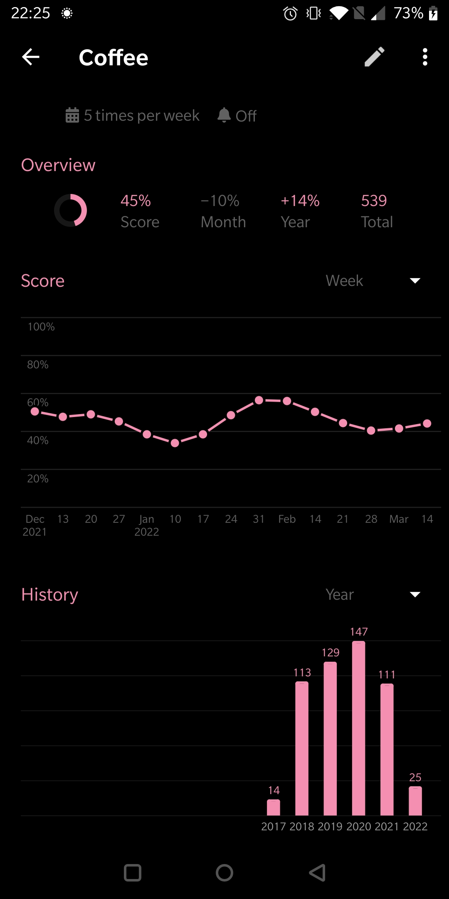
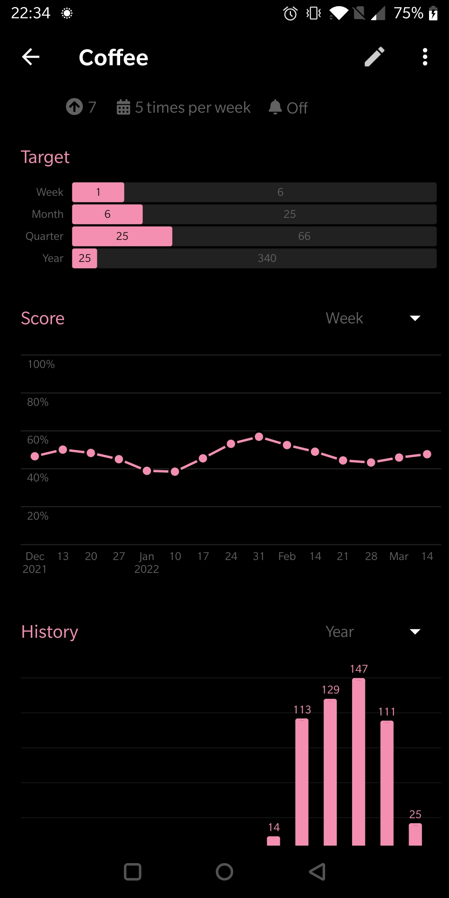

# uhabits_converter
[](https://github.com/ConorSheehan1/uhabits_converter/actions/)
[](https://opensource.org/licenses/MIT)
[](https://github.com/psf/black)
[](https://github.com/ConorSheehan1/uhabits_converter/blob/main/.github/workflows/ci.yml#L25)
[](https://github.com/ConorSheehan1/uhabits_converter/blob/main/.github/workflows/ci.yml#L26)

[Loop Habit / uhabits](https://github.com/iSoron/uhabits) converter.

## Warnings
Please back up your data! By default this project does copy your data to a new db before editing it, but I make no promises it won't break on write or import.

This project is developed in my spare time, so it could be out of sync with [Loop Habit / uHabits](https://github.com/iSoron/uhabits).
It has been tested with version [2.0.3](https://github.com/iSoron/uhabits/releases/tag/v2.0.3).


## Features
1. Convert boolean habits to the new numeric habit type.
    **Example output**
    | Before                                          | After                                         |
    | ----------------------------------------------- | --------------------------------------------- |
    |   |   |


## Installation
```bash
# options 1 pypi
pip install uhabits-converter

# option 2 github release
pip install https://github.com/ConorSheehan1/uhabits_converter/releases/latest/download/uhabits_converter.tar.gz

# option 3 from source
# install python (>=3.8 check pyproject.toml)
# https://github.com/ConorSheehan1/uhabits_converter/blob/main/pyproject.toml#L9
git clone git@github.com:ConorSheehan1/uhabits_converter.git
cd uhabits_converter
poetry install
# if you want the uhabits_converter command available run the lines below.
# otherwise you can use: PYTHONPATH=$(pwd) poetry run task dev
poetry build
pip install .
```

### Steps to convert habits
1. Follow the instructions for **How can I export a full backup of my data?**
    1. https://github.com/iSoron/uhabits/discussions/689 
    > Select the option "Export full backup" on the settings screen.
2. Copy the `.db` file to your computer
3. Run `uhabits_converter` from a terminal
    1. You can specify arguments up front or interactively. e.g.
    `uhabits_converter --inputdb=Loop_Habits_Backup_2022-02-28_220305.db --habits=Gym,Coffee`
    this will convert the habits Gym and Coffee from boolean to numeric habits.
    now you can track hours in the gym and cups of coffee, rather than just the days you went to the Gym or drank coffee.
4. copy the `output.db` file back to your android device.
5. follow the instructions for **How can I restore a full backup?**
    > First, go to the settings screen and tap "Import data". A file browser should appear. Tap the menu icon (the one with three vertical lines) and select the app where your backup is stored, such as Google Drive.

    > If your backup file is located in your SD card, after tapping "Import data", tap the icon with three dots on the top right corner of the screen and select "Show internal storage". Then, tap the menu icon (the one with three vertical lines) and select your SD card.


### Development
See [DEV.md](./DEV.md)
